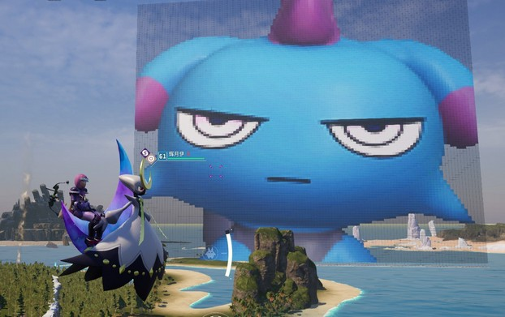
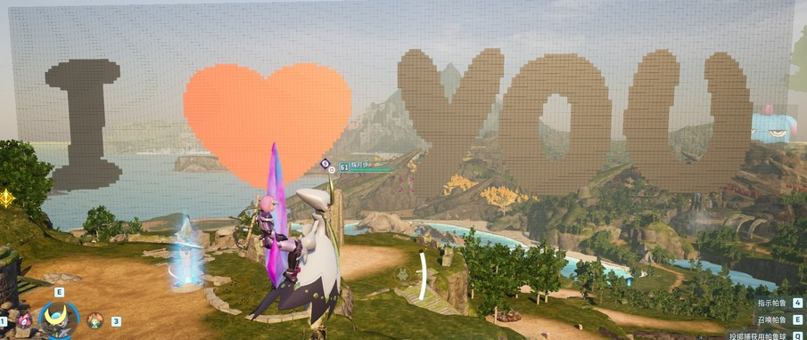
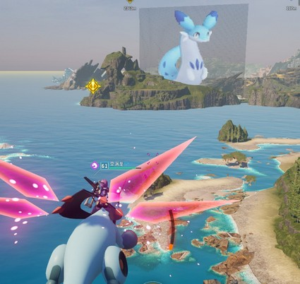
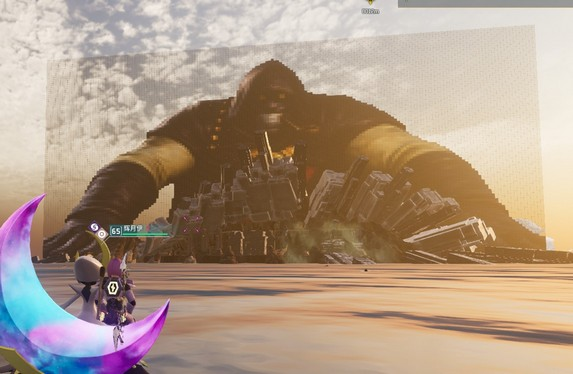
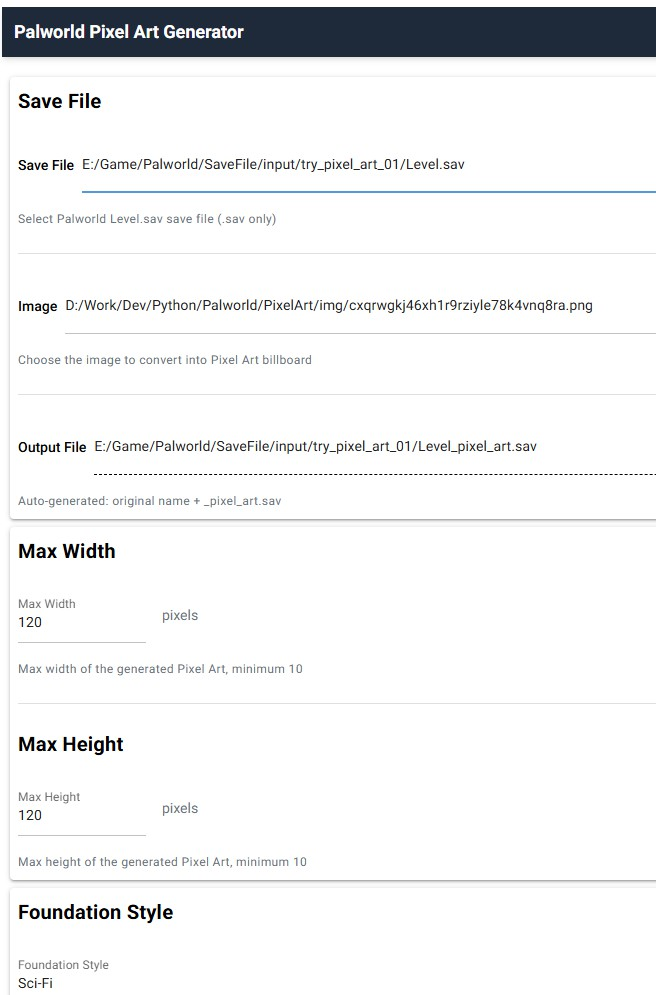
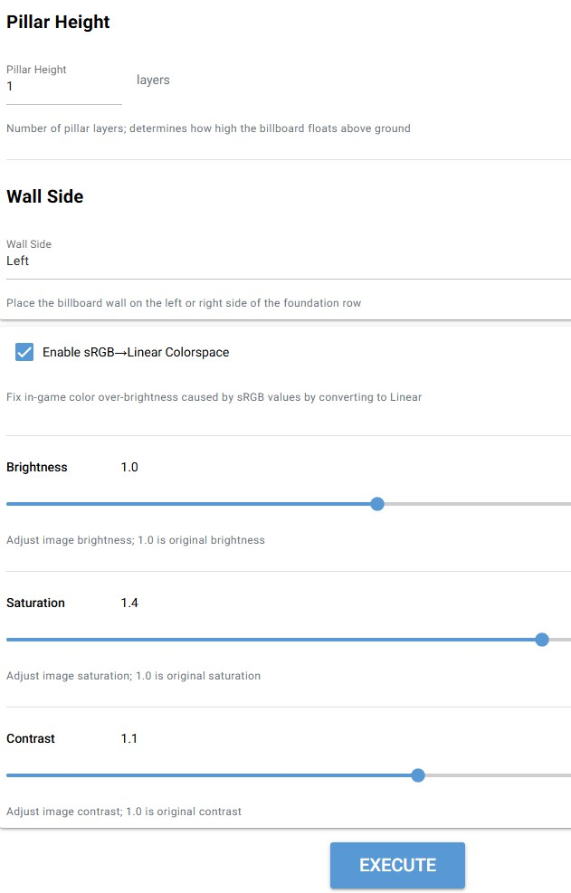
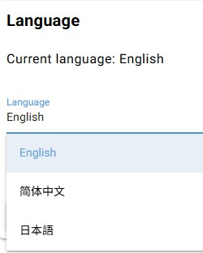
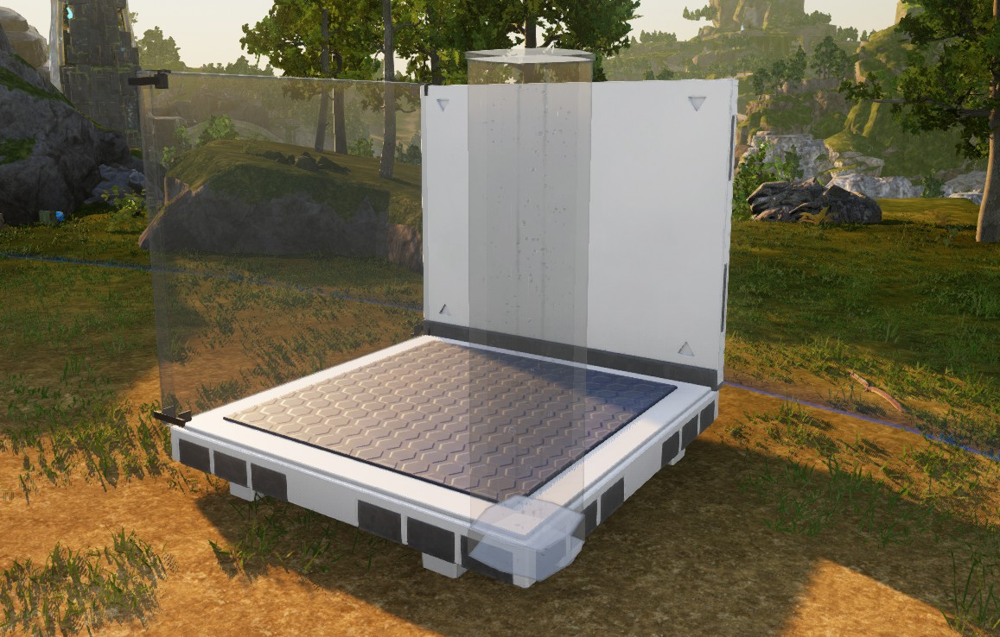

# Language
中文[README.cn.md](README.cn.md)
日本語[README.jp.md](README.jp.md)

# Palworld Pixel Art Generator
Modify Palworld's save file to create a massive pixel art billboard starting from the player's location, displaying any image of your choice within the game.

# Screenshots















# Installation
* Supports Steam version only.
* **Windows:** Download the latest version from the [Releases] page, extract, and run.
* **Other Platforms:** Refer to the "Run from Source" section.

# Preparation
## Prepare Templates
Enter the game and ensure that there is at least one of each of the following: **Future-style Foundation**, **Future-style Walls**, **Glass Pillars**, and **Glass Wall**.



This app will use them as templates to create new foundations, pillars, and walls, rather than creating them from scratch.

**Note:** Your game world must contain at least one foundation, pillar, and wall of the corresponding style to serve as templates.

# Usage
## Save File Location
```
%localappdata%\Pal\Saved\SaveGames\YOURID\RANDOMID\
```

## Windows
### Generate Pixel Art
* Ensure that there is a "Players" subdirectory within the same directory as Level.sav. This folder stores character information, including their location and rotation.
* Run the program and follow the prompts to select the `Level.sav` file.
* Wait for the character list to load, then select a character.
* Select your image.
* Click the execution button at the bottom and wait for the results. (The process is slow; please be patient).
* App will backup your Level.save file automatically
* Enter the game.

### Clear Pixel Art
On app, input desired cleaning radius. Click the remove button to modify the save file, removing foundations, pillars, and walls of the specified style you selected on App within the radius centered on the character.

Alternatively, wait for the structures to decay naturally over time.

## Run from Source
### Download Source Code
* Requires Git installed:
```bash
git clone https://github.com/butaixianran/Palworld-Pixel-Art-Generator
```
* Alternatively, click the green **Code** button and select **Download ZIP**.

### Environment Setup
* Install **Python** (creating a dedicated virtual environment is recommended).
* Install a **C++ build environment**. On Windows, use Visual Studio 2022 with the "C++ Desktop Development" workload.

### Installation
* Open a terminal in the project's `src` directory.
* Run: `pip install -r requirements.txt`

### Execution
* In the `src` directory, run: `python main.py`

# Notes
Detailed explanations for each parameter are provided within the App interface. Additional notes include:

* **Max Width/Height:** The program automatically maintains the image's aspect ratio; it will not stretch the image.
* **Transparent Pixels:** The program uses glass walls painted black to represent transparent pixels, as black glass provides the best transparency effect in-game.
